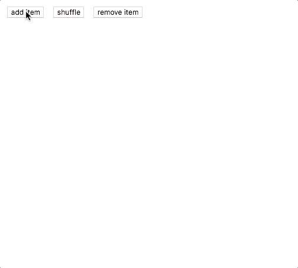
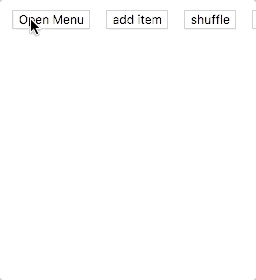

# React Pose Demo

Use react-pose and styled-components make animation list.

使用 react-pose 以及 styled-components 建立動畫列表。





## [Demo](https://reactmaker.github.io/react_pose_demo/)

## 特色(Feature)

* [react 16.3](https://github.com/facebook/react)
* [webpack 4](https://github.com/webpack/webpack)
* [babel 6](https://github.com/babel/babel)
* [eslint](http://eslint.org)
* [styled-components](https://www.styled-components.com/)
* [react-pose](https://www.npmjs.com/package/react-pose)

## 需求配置
* node `^6.11.5`
* npm `^3.10.10`

## 開始

先確定好安裝了 node 6.11.5 以上的版本，接著就可以輸入以下指令

```bash
$ git clone https://github.com/ReactMaker/simple_react_start_kit_2017
$ cd simple_react_start_kit_2017
$ npm install                   # Install project dependencies
$ npm start                     # Compile and launch
```

如果一切成功，就會看到以下畫面，並且瀏覽器會打開的範例頁面


開發當中最常用到的是 `npm start` 指令，我們還有一些其他的指令要介紹給你知道

| `npm run <script>` | 說明                                                                         |
|--------------------|------------------------------------------------------------------------------|
| `start`            | 啟動網站在 8000 port                                                         |
| `dist`             | 編譯整個網站成品到 dist 資料夾下                                             |
| `lint`             | 檢查所有的 js 檔案有沒有符合 coding style                                    |
| `lint:fix`         | 檢查所有的 js 檔案有沒有符合 coding style ，如果是一些簡單的錯誤就會嘗試修復 |
| `deploy`           | 編譯整個網站成品後，上傳至Github靜態頁面，https://[Github 帳號].github.io/[Repositories Name]/#/ |


## Docker


如果想要把專案 build 到 docker 上面跑，請執行這條命令
```
npm run build:docker
```
輸入完命令之後會建立 docker image 名稱為 `reactdocker`


我們可以透過以下指令把映像檔跑起來

```
docker run --name reactmaker -d -P reactdocker
```

因為我是用`-P`參數自動分配port，所以跑起來之後輸入 `docker ps` 察看系統給我哪個 port


接著就可以在瀏覽器輸入localhost:32768看到我們包好的網頁了
